# Tài liệu thiết kế — Course Document RAG Chatbot

Sơ đồ vẽ bằng **Mermaid** (xem trực tiếp trên GitHub hoặc VS Code Mermaid Preview).

Môn học demo: *Software Modeling and Design: UML, Use Cases, Patterns, and Software Architectures*.

---

## 1. Use Case Diagram (3 Actor: Admin, Lecturer, User)

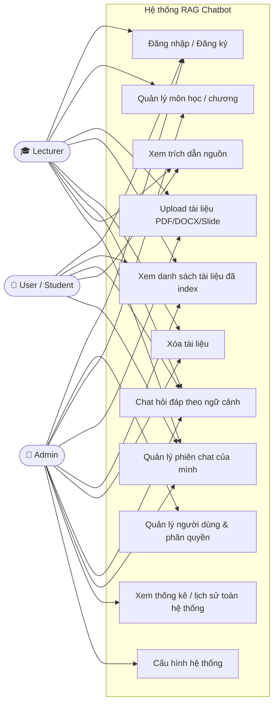

**Quan hệ `<<include>>` / `<<extend>>`:**

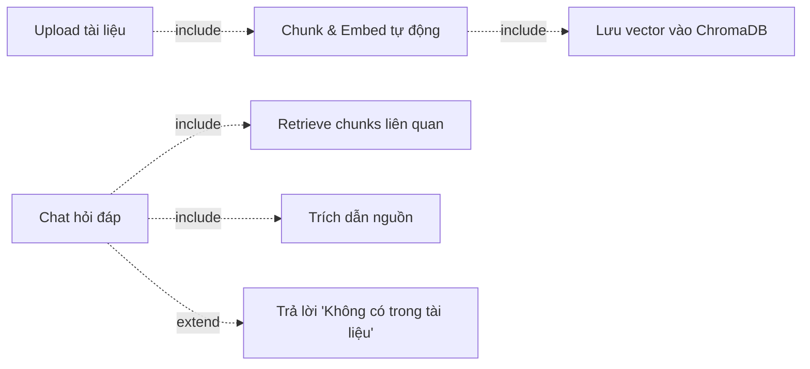

> **Phân quyền tóm tắt:** User = chat + xem; Lecturer = User + quản lý tài liệu/môn học của mình; Admin = toàn quyền + quản lý người dùng + cấu hình.

---

## 2. Class Diagram (UML — Domain Model)

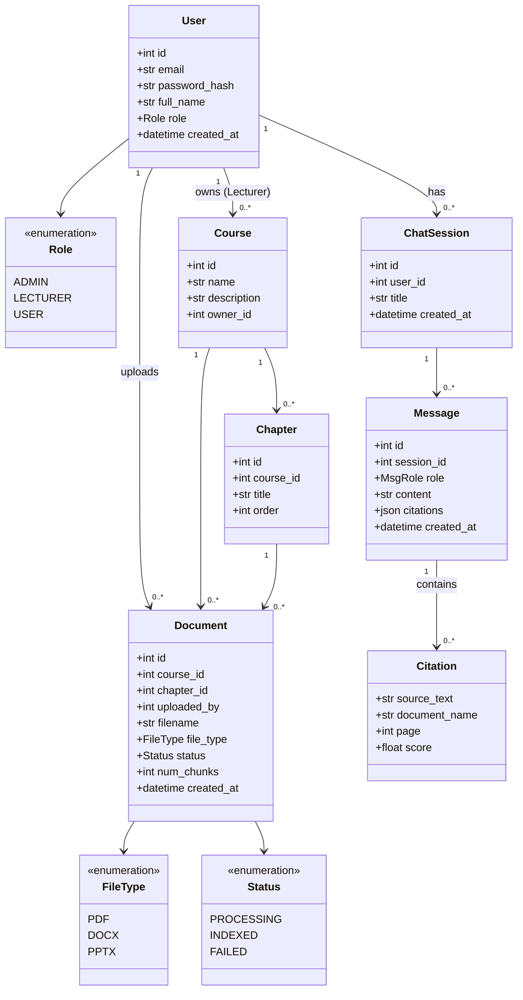

---

## 3. Class Diagram (UML — Lớp ứng dụng theo Module)

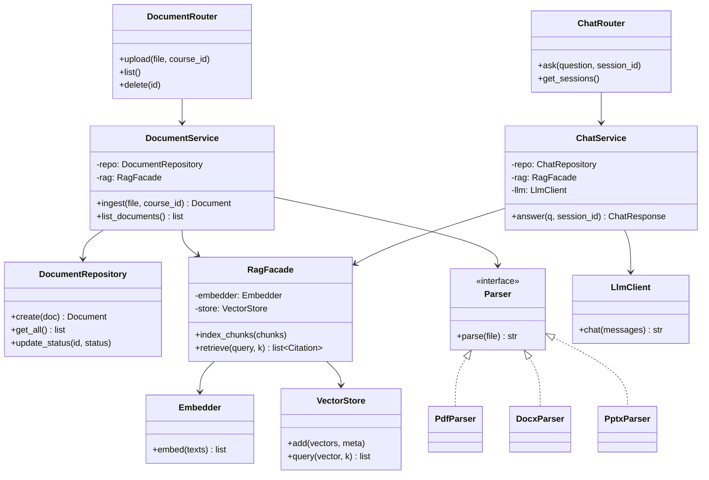

---

## 4. Sequence Diagram — Upload & Ingest tài liệu (Lecturer/Admin)

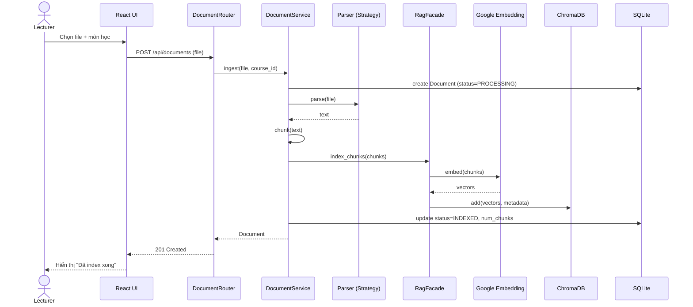

---

## 5. Sequence Diagram — Chat hỏi đáp (RAG Query)

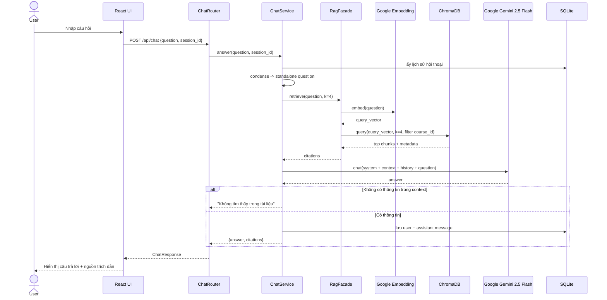

---

## 6. Component / Architecture Diagram (Modular Monolith)

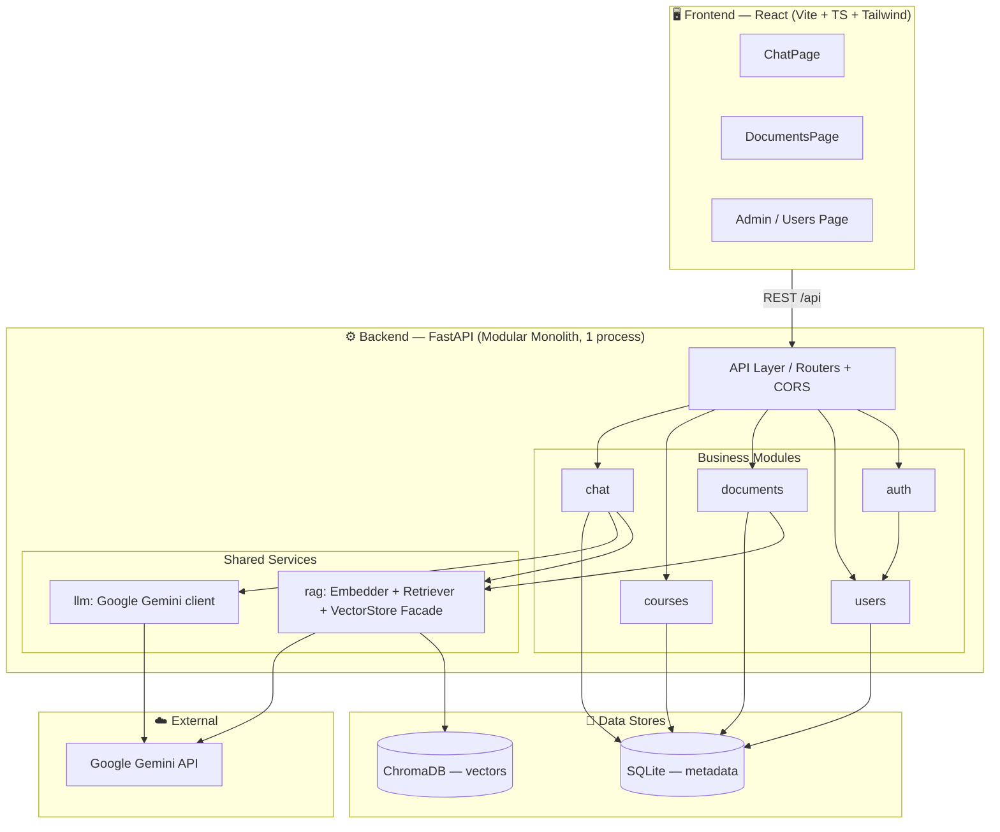

---

## 7. Design Patterns

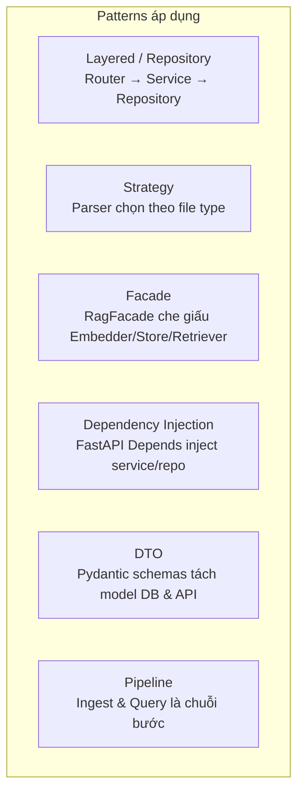

| Pattern | Vấn đề giải quyết | Áp dụng |
|---------|-------------------|---------|
| **Layered / Repository** | Tách biệt HTTP / nghiệp vụ / dữ liệu | Mọi module |
| **Strategy** | Xử lý nhiều định dạng file khác nhau | `parsers.py` (PDF/DOCX/PPTX) |
| **Facade** | Đơn giản hóa subsystem RAG phức tạp | `rag/` module |
| **Dependency Injection** | Loose coupling, dễ test | FastAPI `Depends` |
| **DTO** | Tách API contract khỏi DB schema | Pydantic schemas |
| **Pipeline** | Chuỗi xử lý tuần tự rõ ràng | RAG ingest & query |
| **RBAC (Role-Based Access)** | Phân quyền 3 actor | `require_role()` dependency |

---

## 8. Deployment View

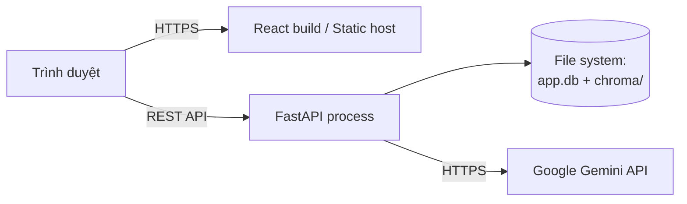

Toàn bộ backend chạy trong **một process** (đúng tinh thần Modular Monolith). Dữ liệu lưu local (SQLite file + ChromaDB persistent dir). Có thể đóng gói Docker 1 container backend + 1 static frontend.

---

## 9. ERD — Lược đồ quan hệ dữ liệu (SQLite)

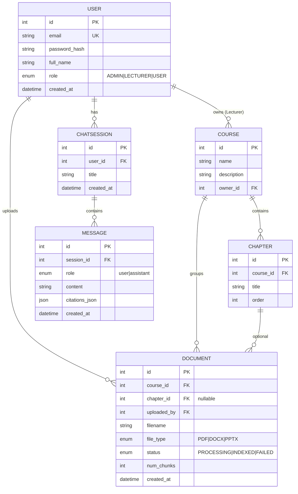

> Vector + chunk text **không** lưu trong SQLite mà nằm trong ChromaDB, kèm metadata `{document_id, course_id, chapter, chunk_index, source_text, page}`.

---

## 10. State Diagram — Vòng đời tài liệu (Document)

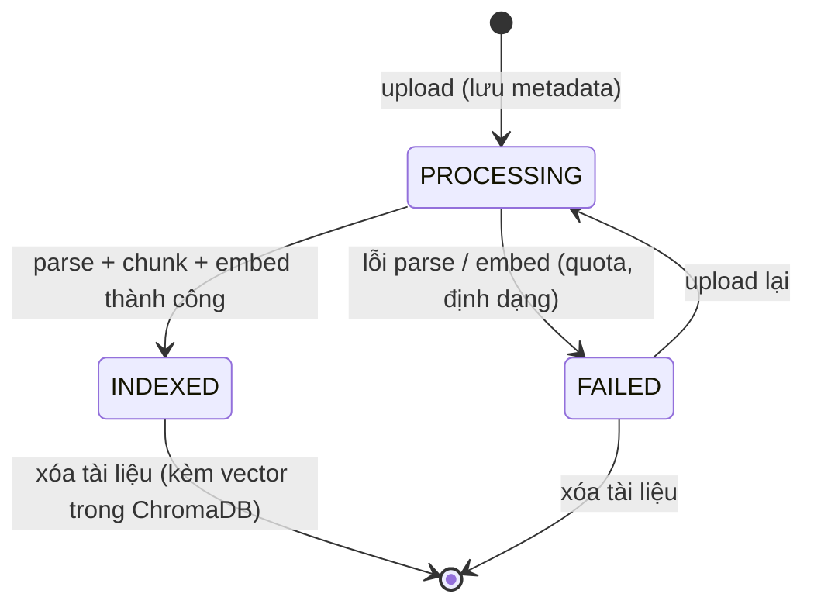

---

## 11. Activity Diagram — Luồng xử lý câu hỏi (RAG Query)

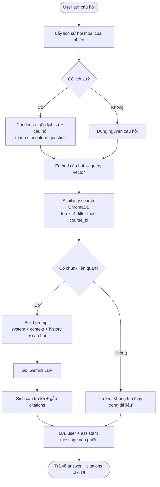

---

## 12. Package / Module Diagram (cấu trúc backend)

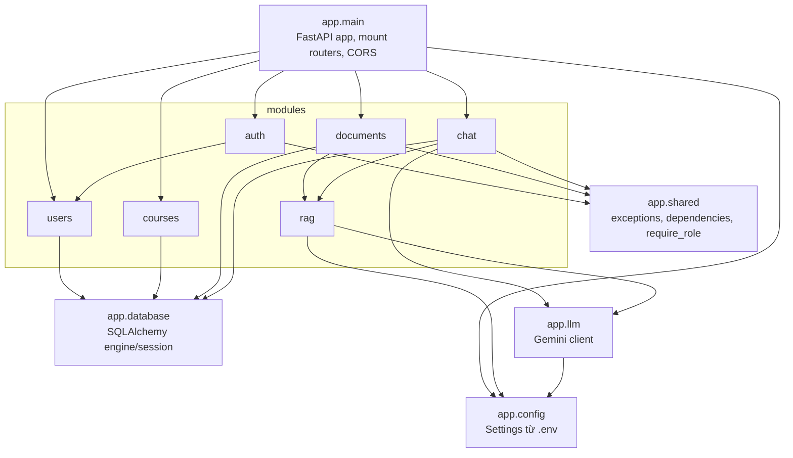
