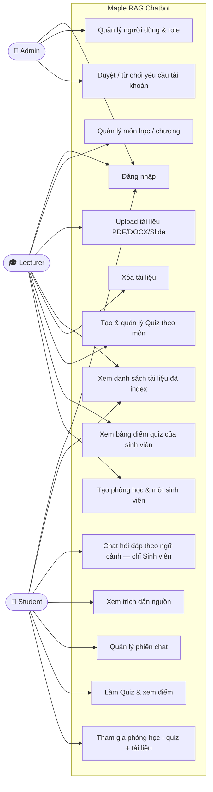
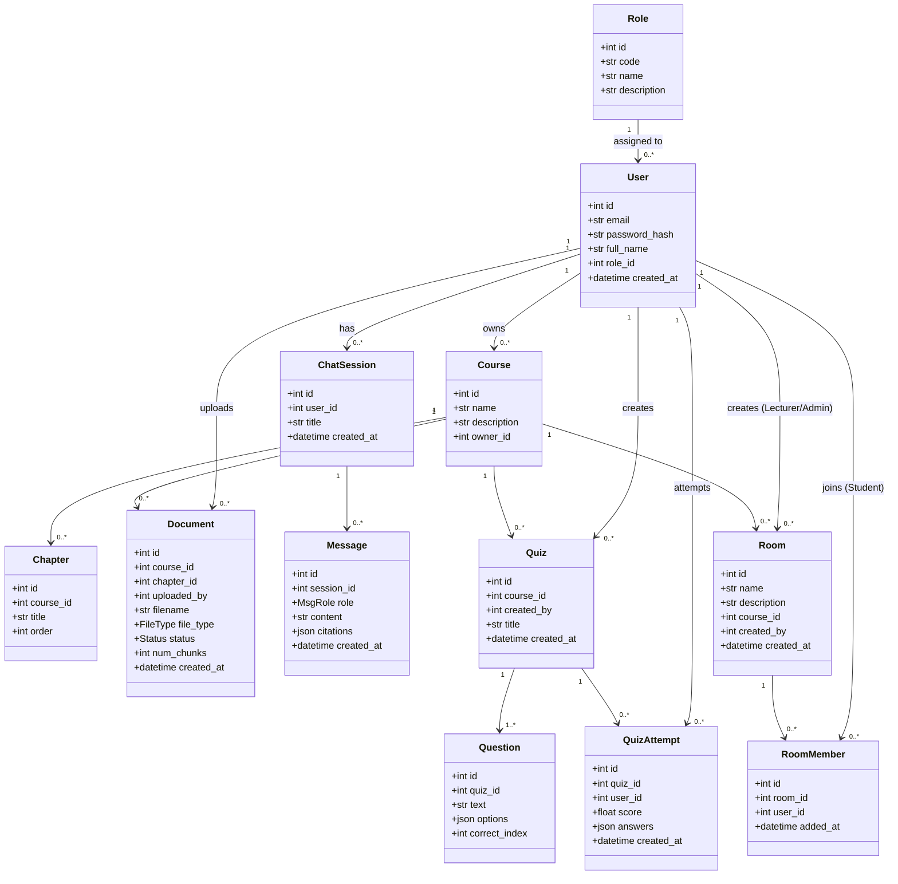
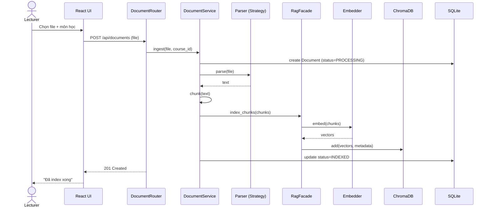
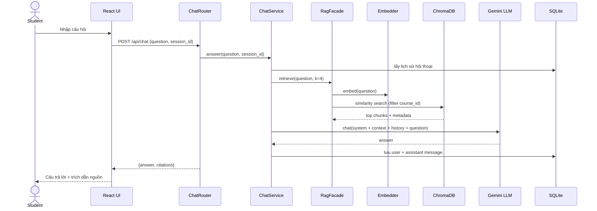
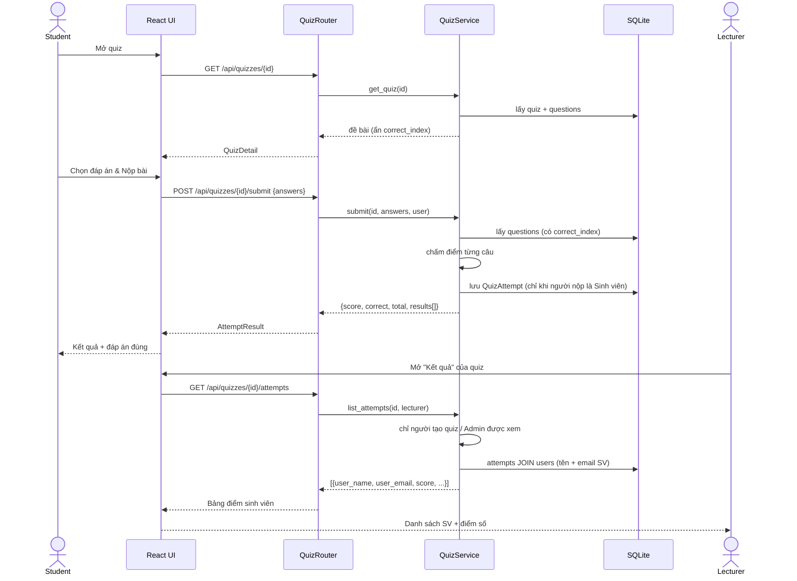
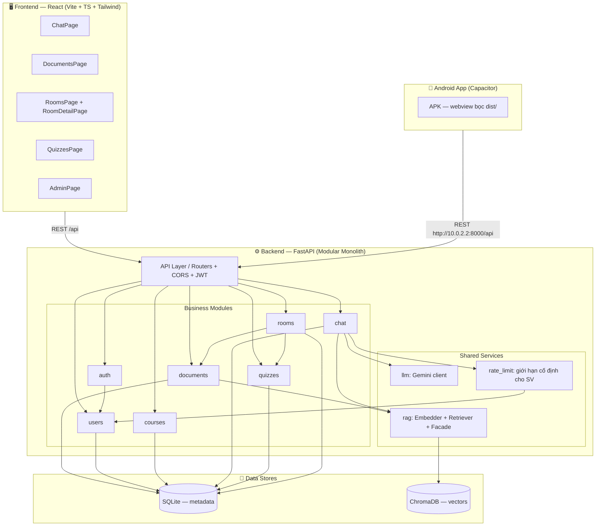
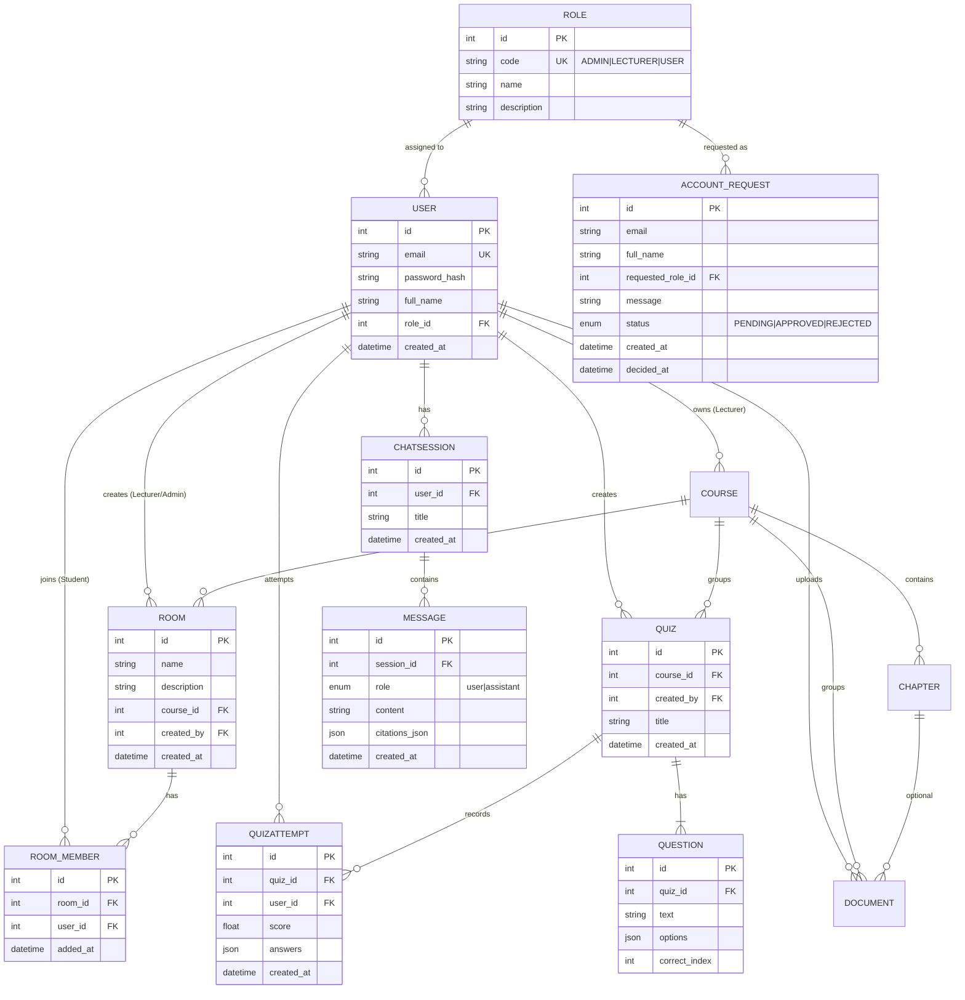
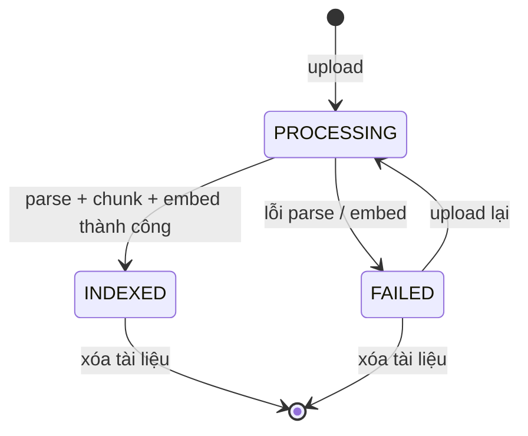

# Maple — Course Document RAG Chatbot

Web app chatbot hỏi đáp dựa trên tài liệu môn học (RAG — Retrieval Augmented Generation). Giảng viên upload tài liệu bài giảng (PDF/DOCX/PPTX), hệ thống tự động chunk + embed, và sinh viên đặt câu hỏi được trả lời **chỉ trong phạm vi tài liệu**, kèm **trích dẫn nguồn**. Cùng một codebase chạy được cả **website** lẫn **app Android** (Capacitor).

Môn học demo: _Software Modeling and Design: UML, Use Cases, Patterns, and Software Architectures_ (Gomaa).

---

## Tính năng chính

| Tính năng                 | Mô tả                                                                                                                                                                       |
| ------------------------- | --------------------------------------------------------------------------------------------------------------------------------------------------------------------------- |
| **Chat hỏi đáp RAG**      | Sinh viên chat theo ngữ cảnh hội thoại, câu trả lời bám sát tài liệu đã index và luôn kèm trích dẫn nguồn (tên tài liệu + trang). Render công thức toán LaTeX (KaTeX)       |
| **Quản lý tài liệu**      | Giảng viên upload PDF/DOCX/PPTX → tự động parse, chunk, embed vào vector store; theo dõi trạng thái PROCESSING / INDEXED / FAILED                                           |
| **Môn học & chương**      | Giảng viên tạo và quản lý môn học của mình; tài liệu, quiz, phòng học đều gắn theo môn                                                                                      |
| **Phòng học (Rooms)**     | Giảng viên tạo phòng gắn với môn học, mời sinh viên qua email; trong phòng có bảng tin thông báo, quiz để làm và tài liệu để học/tải về                                     |
| **Quiz trắc nghiệm**      | Giảng viên tạo quiz theo phòng học, tùy chọn mật khẩu + thời gian mở/đóng; sinh viên làm bài, chấm điểm tức thì; bảng điểm (kèm tên, email SV) tự gửi về giảng viên         |
| **AI soạn quiz (Gemini)** | Giảng viên nhờ AI soạn nháp đề từ tài liệu môn học, duyệt & chỉnh sửa trước khi lưu                                                                                         |
| **Bảng điểm & xem lại**   | Sinh viên xem mọi kết quả quiz theo môn, xem lại từng lượt làm (đáp án đã chọn vs đáp án đúng)                                                                              |
| **Yêu cầu tài khoản**     | Không có đăng ký công khai — người dùng gửi yêu cầu ở trang đăng nhập, Admin duyệt → tài khoản tạo tự động, mật khẩu gửi qua email (Brevo/SMTP). Chống spam theo IP         |
| **Phân quyền 3 vai trò**  | **Admin** (quản lý người dùng + duyệt yêu cầu), **Lecturer** (tài liệu, môn học, quiz, phòng học), **Student** (chat AI, làm quiz, tham gia phòng). JWT + role-based access |
| **Đăng nhập Google**      | Đăng nhập bằng Google OAuth với email đã được cấp tài khoản                                                                                                                 |
| **App Android**           | Build APK từ cùng codebase React qua Capacitor                                                                                                                              |

> Chat AI **chỉ dành cho Sinh viên** (giới hạn ~30 câu/phút mỗi SV). Giảng viên không dùng AI chat; giao diện Admin chỉ có mục Quản lý người dùng.

---

## Kiến trúc & Tech stack

**Modular Monolith** — một process FastAPI, chia module nghiệp vụ rõ ràng (router → service → repository), module `rag`/`llm` dùng chung qua Facade.

| Layer        | Công nghệ                                                        |
| ------------ | ---------------------------------------------------------------- |
| Frontend     | React 18 + Vite + TypeScript + Tailwind CSS                      |
| Mobile       | Capacitor 8 (Android APK từ cùng codebase web)                   |
| Backend      | Python 3.11+ / FastAPI                                           |
| LLM          | Google Gemini 2.5 Flash (có thể dùng `local` mode không cần key) |
| Embedding    | Google gemini-embedding-001 (hoặc local hash-based khi keyless)  |
| Vector store | ChromaDB (embedded/local)                                        |
| Metadata DB  | SQLite (SQLAlchemy)                                              |
| Auth         | JWT (role-based: ADMIN / LECTURER / USER)                        |

---

# Thiết kế hệ thống

> Sơ đồ vẽ bằng **Mermaid** — xem trực tiếp trên GitHub.

## 1. Use Case Diagram



> Admin **chỉ quản lý người dùng** + duyệt yêu cầu tài khoản (UI không có chat/quiz/phòng/tài liệu).
> Giảng viên **không** dùng AI chat (UC7) — hỏi đáp RAG là tính năng dành cho Sinh viên.

## 2. Class Diagram (Domain Model)



## 3. Sequence Diagram — Upload & Ingest tài liệu



## 4. Sequence Diagram — Chat hỏi đáp (RAG Query)



## 5. Sequence Diagram — Làm Quiz & Chấm điểm



## 5b. Sequence Diagram — Phòng học (Rooms)

```mermaid
sequenceDiagram
    actor L as Lecturer
    actor S as Student
    participant FE as React UI
    participant R as RoomRouter
    participant SV as RoomService
    participant DB as SQLite

    L->>FE: Tạo phòng (tên + môn học)
    FE->>R: POST /api/rooms {name, course_id}
    R->>SV: create(payload, lecturer)
    SV->>DB: lưu Room (created_by=lecturer)
    R-->>FE: RoomOut

    L->>FE: Mời sinh viên (email)
    FE->>R: POST /api/rooms/{id}/members {email}
    R->>SV: invite(id, email, lecturer)
    SV->>SV: chỉ người tạo/Admin; chỉ mời role USER; không trùng
    SV->>DB: lưu RoomMember
    R-->>FE: MemberOut

    S->>FE: Mở "Phòng học"
    FE->>R: GET /api/rooms
    R->>SV: list_for(student)
    SV->>DB: rooms JOIN room_members (chỉ phòng được mời)
    R-->>FE: [RoomOut]
    S->>FE: Vào phòng
    FE->>R: GET /api/rooms/{id}
    R->>SV: detail(id, student)
    SV->>DB: members + quizzes + documents của môn
    R-->>FE: RoomDetail
    FE-->>S: Quiz để làm + tài liệu để học
```

## 6. Component / Architecture Diagram



## 7. ERD — Lược đồ quan hệ dữ liệu



## 8. State Diagram — Vòng đời tài liệu



## 9. Design Patterns

| Pattern                  | Áp dụng                                                      |
| ------------------------ | ------------------------------------------------------------ |
| **Layered / Repository** | Mọi module: router → service → repository                    |
| **Strategy**             | `parsers.py` — chọn parser theo file type (PDF/DOCX/PPTX)    |
| **Facade**               | `rag/` module — che giấu embedder + vector_store + retriever |
| **Dependency Injection** | FastAPI `Depends` inject service/repo/session                |
| **DTO**                  | Pydantic schemas tách biệt model DB và API contract          |
| **Pipeline**             | RAG ingest & query — chuỗi bước rõ ràng                      |
| **RBAC**                 | `require_role()` dependency — phân quyền 3 actor             |

---

## Cài đặt & Chạy

### Yêu cầu

- Python 3.11+
- Node.js 18+
- (Tuỳ chọn) Google API Key để dùng Gemini — không cần nếu dùng mode `local`

### 1. Backend

```bash
cd backend
python -m venv .venv

# Windows
.venv\Scripts\activate
# macOS/Linux
source .venv/bin/activate

pip install -r requirements.txt
cp .env.example .env   # xem cấu hình bên dưới

python seed.py         # tạo 3 user demo + môn học + quiz mẫu

uvicorn app.main:app --reload --port 8000
```

API docs: http://localhost:8000/docs

**Cấu hình `.env`:**

```env
# Mode "local" (không cần key) — AI trả lời placeholder, RAG vẫn hoạt động
EMBED_PROVIDER=local
LLM_PROVIDER=local

# Hoặc dùng Gemini thật:
GOOGLE_API_KEY=AIza...
EMBED_PROVIDER=gemini
LLM_PROVIDER=gemini
GOOGLE_CHAT_MODEL=gemini-2.5-flash
GOOGLE_EMBED_MODEL=gemini-embedding-001

CHROMA_DIR=./data/chroma
DATABASE_URL=sqlite:///./data/app.db

# Bắt buộc đổi: chuỗi ngẫu nhiên dài
JWT_SECRET=<chuoi-ngau-nhien-dai-cua-ban>
JWT_EXPIRE_MINUTES=720

CORS_ORIGINS=http://localhost:5173,http://localhost,https://localhost,capacitor://localhost
```

> Muốn dùng **SQL Server** thay SQLite: chỉ cần đổi `DATABASE_URL` sang dạng
> `mssql+pyodbc://<user>:<password>@localhost/maple?driver=ODBC+Driver+17+for+SQL+Server&TrustServerCertificate=yes`
> (cần ODBC Driver 17). App tự tạo bảng khi khởi động.

### 2. Frontend (Web)

```bash
cd frontend
npm install
npm run dev
```

Mở http://localhost:5173

### 3. Android APK (Capacitor)

> Yêu cầu: Android Studio (kèm JDK + SDK).

```bash
cd frontend
npm install

# Backend trên máy host, chạy trong emulator:
$env:VITE_API_BASE = "http://10.0.2.2:8000/api"   # PowerShell
# export VITE_API_BASE="http://10.0.2.2:8000/api"  # bash

npm run cap:apk
# APK: android/app/build/outputs/apk/debug/app-debug.apk
```

Điện thoại thật cùng Wi-Fi: thay `10.0.2.2` bằng IP LAN của máy chạy backend và chạy backend với `--host 0.0.0.0`.

### Tài khoản demo (chỉ local)

Chạy `python seed.py` — email + mật khẩu 3 tài khoản demo (Admin / Lecturer / Student) in ra console.

> ⚠️ Không chạy `seed.py` trên production (script tự từ chối khi `DATABASE_URL` không phải SQLite). Trên production, Admin đầu tiên tạo từ env `ADMIN_EMAIL` / `ADMIN_PASSWORD`.

---

## Quy trình sử dụng

1. **Cấp tài khoản** — người dùng bấm _Yêu cầu tài khoản_ ở trang đăng nhập → Admin duyệt trong tab _Yêu cầu chờ duyệt_ → mật khẩu gửi qua email.
2. **Giảng viên** — tạo môn học, upload tài liệu (đợi trạng thái _Đã index_), tạo phòng học, mời sinh viên, giao quiz (tự soạn hoặc nhờ AI soạn nháp).
3. **Sinh viên** — vào _Hỏi đáp_ chọn môn và đặt câu hỏi (có trích dẫn nguồn); vào _Phòng học_ để làm quiz, xem thông báo và tải tài liệu; xem _Bảng điểm_ và xem lại bài làm.
4. **Admin** — quản lý người dùng (tạo, đổi vai trò, xóa) và duyệt yêu cầu tài khoản.

---

## Deploy free: Vercel + Render + Neon

| Thành phần | Dịch vụ                                                    | Ghi chú                                                                                                                                                                                          |
| ---------- | ---------------------------------------------------------- | ------------------------------------------------------------------------------------------------------------------------------------------------------------------------------------------------ |
| Database   | [Neon](https://neon.tech) (Postgres + pgvector)            | Đổi prefix `postgresql://` → `postgresql+psycopg2://` trong `DATABASE_URL`                                                                                                                       |
| Backend    | [Render](https://render.com) (Blueprint đọc `render.yaml`) | Điền env: `DATABASE_URL`, `GOOGLE_API_KEY`, `GOOGLE_OAUTH_CLIENT_ID`, `BREVO_API_KEY`, `MAIL_FROM`, `ADMIN_EMAIL`, `ADMIN_PASSWORD`, `CORS_ORIGINS`, `APP_LOGIN_URL`. Free tier ngủ sau ~15 phút |
| Frontend   | [Vercel](https://vercel.com) (Root Directory: `frontend`)  | Env: `VITE_API_BASE=https://<app>.onrender.com/api`, `VITE_GOOGLE_CLIENT_ID`                                                                                                                     |

- **Google OAuth**: tạo OAuth Client ID (Web) tại Google Cloud Console, thêm origins `http://localhost:5173` + domain Vercel.
- **Email cấp tài khoản**: Render free chặn SMTP → dùng [Brevo](https://www.brevo.com) API (free 300 mail/ngày): verify sender + lấy API key `xkeysib-...`. Chạy local vẫn dùng được Gmail SMTP (`SMTP_USER` + `SMTP_PASSWORD`).

---

## Kiểm thử & Đánh giá

```bash
cd backend

# Unit/API tests (pytest, DB tạm + FK enforcement)
python -m pytest tests/ -q

# Smoke test toàn bộ chức năng qua API (không cần API key)
python -m tests.smoke_all
python -m tests.smoke_rooms

# Đánh giá RAG: 50 câu hỏi + ground truth (tests/test_set.json), LLM-as-judge
python -m tests.evaluate --course-id 1
```

---

## Cấu trúc thư mục

```
swd/
├── readme.md
├── backend/
│   ├── app/
│   │   ├── main.py              # FastAPI app, CORS, mount routers
│   │   ├── config.py            # Settings từ .env
│   │   ├── database.py          # SQLAlchemy engine + auto-migration nhẹ
│   │   ├── llm/                 # Gemini client wrapper
│   │   ├── shared/              # dependencies (JWT, require_role), mailer, rate-limit
│   │   └── modules/             # auth, account_requests, users, courses,
│   │                            # documents, chat, rag, quizzes, rooms
│   ├── seed.py                  # Seed user demo + môn học + quiz mẫu
│   ├── tests/                   # pytest + smoke test + test_set.json (50 câu)
│   └── requirements.txt
└── frontend/
    ├── src/
    │   ├── pages/               # Chat, Documents, Rooms, Quizzes, Grade, Admin, Login
    │   ├── components/          # chat, quiz, profile, layout...
    │   ├── api/client.ts        # Axios + VITE_API_BASE (web & APK)
    │   └── auth/AuthContext.tsx
    ├── android/                 # Native Android project (Capacitor)
    ├── capacitor.config.ts
    └── vite.config.ts
```
